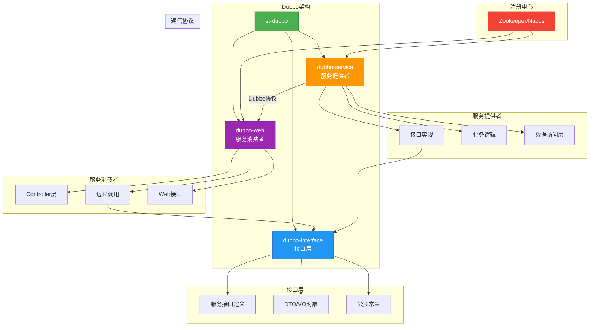

# st-dubbo

> 🔧 Dubbo分布式服务框架学习项目

本项目用于学习和实践Apache Dubbo分布式服务框架，包含接口定义、服务提供者和服务消费者三个核心模块。

## 📊 项目架构图

```mermaid
graph TB
    subgraph "Dubbo架构"
        A[st-dubbo] --> B[dubbo-interface<br/>接口层]
        A --> C[dubbo-service<br/>服务提供者]
        A --> D[dubbo-web<br/>服务消费者]
    end
    
    subgraph "接口层"
        B --> E[服务接口定义]
        B --> F[DTO/VO对象]
        B --> G[公共常量]
    end
    
    subgraph "服务提供者"
        C --> H[接口实现]
        C --> I[业务逻辑]
        C --> J[数据访问层]
    end
    
    subgraph "服务消费者"
        D --> K[Controller层]
        D --> L[远程调用]
        D --> M[Web接口]
    end
    
    subgraph "注册中心"
        N[Zookeeper/Nacos] --> C
        N --> D
    end
    
    subgraph "通信协议"
        C -->|Dubbo协议| D
    end
    
    L --> B
    H --> B
    
    style A fill:#4CAF50,stroke:#2E7D32,color:#fff
    style B fill:#2196F3,stroke:#1565C0,color:#fff
    style C fill:#FF9800,stroke:#F57C00,color:#fff
    style D fill:#9C27B0,stroke:#6A1B9A,color:#fff
    style N fill:#F44336,stroke:#C62828,color:#fff
```